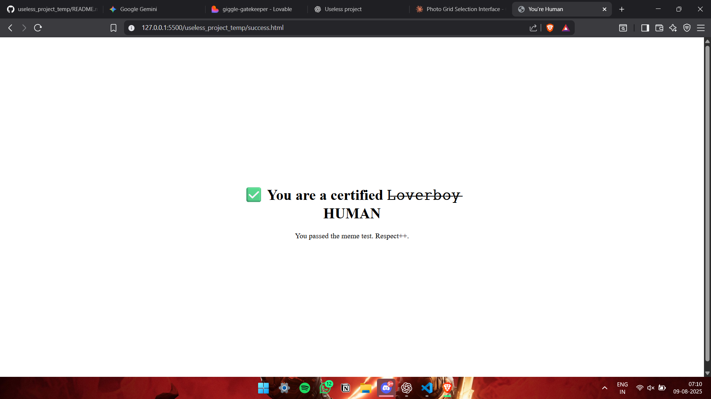

# Meme CAPTCHA  🎯

### Team Name: SYBAU

### Team Members
- Team Lead: Karthik Murali - college of engineering perumon
- Member 2: K Amithkrishna - college of engineering perumon

### Project Description
 We’re making a fun, meme-fueled CAPTCHA where users prove they’re human — not by ticking a traffic lights checkboxes, but by naming iconic memes. No boring puzzles — just straight-up meme recognition.

### The Problem (that doesn't exist)
Boredom to solve flipping captcha

### The Solution (that nobody asked for)
 meme-fueled CAPTCHA to make thing more funnier.

## Technical Details
### Technologies/Components Used
For Software:
- HTML,CSS,JAVASCRIPT
- Tools used: VS Code (Code Editor)
GitHub (Version Control & Hosting via GitHub Pages)
Web Browser (brave)
Figma (for design mockups)

### Implementation
For Software:
# Installation
Download the files, open index.html in your browser, and start guessing memes.

# Run
[commands]

### Project Documentation
For Software:

# Screenshots (Add at least 3)

*intro check box*

*the meme selection space

*final verified section

Video
[video showing how this captcha works](https://drive.google.com/file/d/1la9LwqyFbK-F_ZVWfvVNp_nflHzwLxUG/view?usp=sharing)

## Team Contributions
- [Karthik]: I designed the user interface, implemented the core HTML/CSS/JavaScript logic for displaying memes and    validating answers, and managed the overall project workflow.
- [Amithkrishna]: Selected the memes and helped in codding.

---
Made with ❤️ at TinkerHub Useless Projects 

